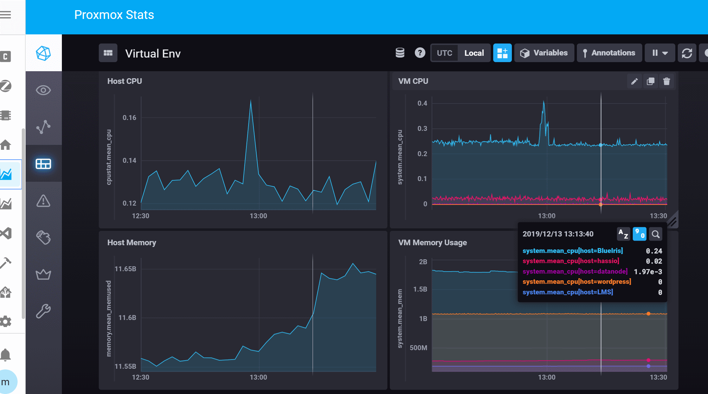

# Proxmox telemetry via Influxdb and Chronograf

### Note : This won't currently work if you're running the InfluxDB server as a Home Assistant addin.  The config there doesn't support it and has been ruled out as a change for the time being - see [this link](https://github.com/hassio-addons/addon-influxdb/issues/39) for an explanation.

I wanted to get some telemetry data from my Proxmox instance - primarily so I could make sure there were no times of the day or week where I was unduly stressing the machine.  To achieve this I spent a few minutes configuring the server to log telemetry data to InfluxDB.  Surprisingly, it was relatively simple to do.

## Pre-requisites

I have an influx database running in it's own container on the Proxmox server.  If you don't then either set it up, or make sure you can configure the hassio plugin.  I didn't verify that step since I don't use it.

## Method

### Proxmox Configuration

On the proxmox node open a console, and type

> nano /etc/pve/status.cfg

You'll probably get a warning that you're creating a new file.  That's OK - you probably need to as by default the file doesn't exist.

Enter the following in the file

    influxdb:
      server 192.168.3.3
      port 8089
 
Remember to replace the IP and port numbers to match your own network!!!

See https://pve.proxmox.com/wiki/External_Metric_Server for details

### InfluxDB setup

You'll need to open a UDP port for the telemetry data.  Proxmox doesn't use other protocols for this so you have no choice.

On your influxDB server, edit the config file

> nano /etc/influxdb/influxdb.conf

and find the section that controls UDP access.  This has a header of [[UDP]]

make sure the section looks like the following.  You'll need to change a few things from the defaults.

    [[udp]]
       enabled = true
       bind-address = "0.0.0.0:8089"
       database = "proxmox"
       batch-size = 1000
       batch-timeout = "1s"
       
The database name should be proxmox, as above.

Now save and exit the file and restart Influx with 

> service influxdb restart

That's it.  Telemetry should start to flow into InfluxDB.  After that you can set up some reporting in Grafana or Chronograf and be happy.

### Read more...

* [All Posts](https://marcjenningsuk.github.io/Home-AssistantConfiguration/)
